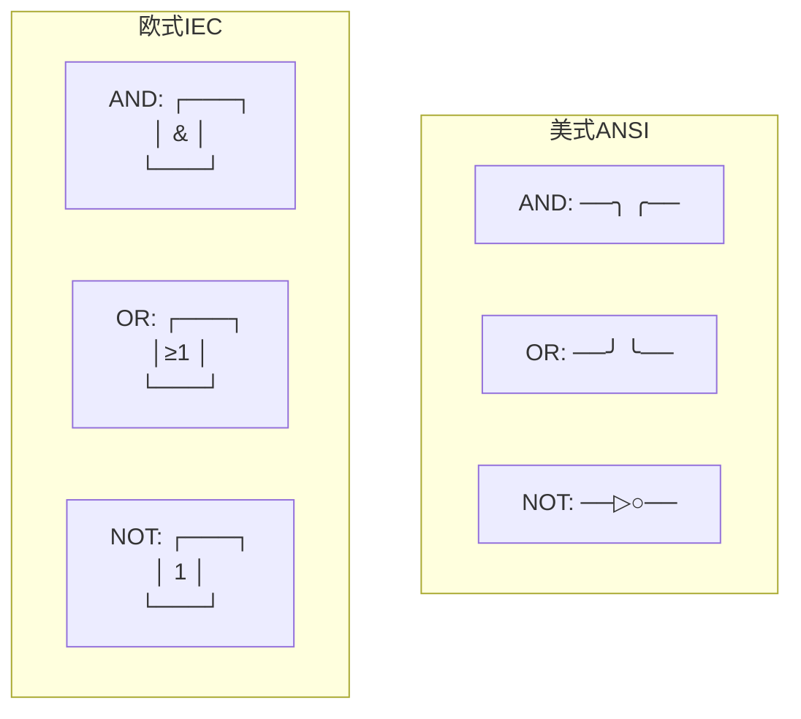
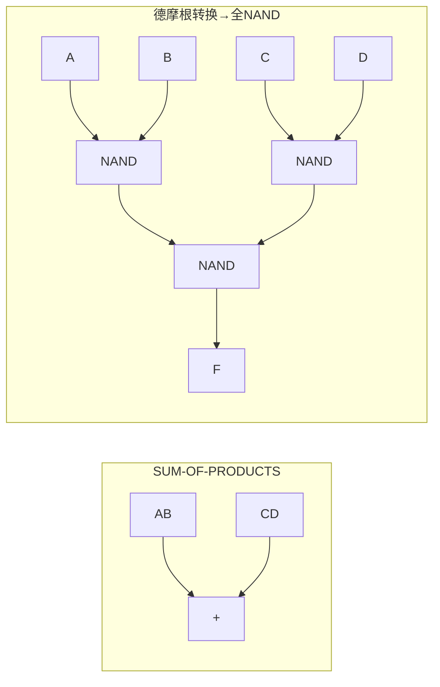
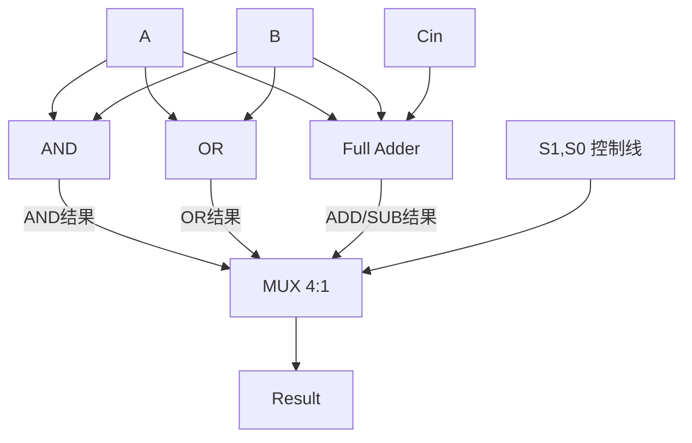

# 数字逻辑电路核心知识完全讲解

---

## 一、门电路符号

### 1.1 基本逻辑门（Basic Gates）

| 门类型 | 美式符号 (ANSI/IEEE) | 欧式符号 (IEC 60617) | 逻辑表达式 | 功能说明 |
|--------|---------------------|----------------------|-----------|---------|
| **NOT** | `▷` 三角形+小圆圈 | `1` 框内写 "1" | `F = Ā` | 输出与输入相反 |
| **AND** | `D` 形（半圆弧+直线） | `&` 方框内写 "&" | `F = A·B` | 全1出1 |
| **OR** | 弧形箭头 (shield) | `≥1` 方框内写 "≥1" | `F = A+B` | 有1出1 |
| **XOR** | `=1` 弧形+弧线 | 方框内写 "=1" | `F = A⊕B` | 不同出1 |
| **NAND** | AND + 输出小圈 | `&` + 输出小圈 | `F = (A·B)\'` | 全1出0 |
| **NOR** | OR + 输出小圈 | `≥1` + 输出小圈 | `F = (A+B)\'` | 有1出0 |
| **XNOR** | XOR + 输出小圈 | `=1` + 输出小圈 | `F = (A⊕B)\'` | 相同出1 |

### 1.2 美式 vs 欧式符号快速识别



**核心区别**：美式用**形状**区分功能（D形=AND，盾形=OR）；欧式用**方框内的标注字符**区分（`&`=AND，`≥1`=OR，`=1`=XOR）。欧式中，输入端/输出端的小圆圈表示取反。

| 欧式标注 | 含义 |
|----------|------|
| `&` | AND（与） |
| `≥1` | OR（或）—至少一个1 |
| `=1` | XOR（异或）—恰好一个1 |
| `1` | 缓冲/非门 |
| `= ` | XNOR（同或） |
| 输入端○ | 该输入先取反 |
| 输出端○ | 输出取反 |

> **技巧**：拿到欧式符号，看框内字符就知道逻辑功能，不用记形状。

---

## 二、德摩根定律（De Morgan's Laws）

### 2.1 两个核心公式

| # | 公式 | 含义 |
|---|------|------|
| ① | **(A·B)\' = A\' + B\'** | 与的非 = 非的或 |
| ② | **(A+B)\' = A\' · B\'** | 或的非 = 非的与 |

### 2.2 推广形式（n变量）

- **(X₁·X₂·…·Xₙ)\' = X₁\' + X₂\' + … + Xₙ\'**
- **(X₁+X₂+…+Xₙ)\' = X₁\' · X₂\' · … · Xₙ\'**

### 2.3 用德摩根定律转换电路

**典型场景**：用全NAND门实现任意电路

```
原表达式: F = AB + CD
             ↓ 两次取反（恒等变换）
         F = [(AB + CD)'']  
             ↓ 内层用德摩根①
         F = [(AB)' · (CD)']'
             ↓ 全部变为NAND-NAND结构
```



> **口诀**：与的非拆成非的或；或的非拆成非的与。简单来说——**拆非号，换运算**。


<｜｜DSML｜｜tool_calls>
<｜｜DSML｜｜parameter name="command" string="true">@'
# 数字逻辑电路核心知识完全讲解

---

## 一、门电路符号

### 1.1 基本逻辑门（Basic Gates）

| 门类型 | 美式符号 (ANSI/IEEE) | 欧式符号 (IEC 60617) | 逻辑表达式 | 功能说明 |
|--------|---------------------|----------------------|-----------|---------|
| **NOT** | ▷ 三角形+小圆圈 | 框内写 \"1\" | `F = Ā` | 输出与输入相反 |
| **AND** | D形（半圆弧+直线） | 框内写 \"&\" | `F = A·B` | 全1出1 |
| **OR** | 弧形箭头 (shield) | 框内写 \"≥1\" | `F = A+B` | 有1出1 |
| **XOR** | 弧形+弧线 | 框内写 \"=1\" | `F = A⊕B` | 不同出1 |
| **NAND** | AND + 输出小圈 | \"&\" + 输出小圈 | `F = (A·B)\"\" | 全1出0 |
| **NOR** | OR + 输出小圈 | \"≥1\" + 输出小圈 | `F = (A+B)\"\" | 有1出0 |
| **XNOR** | XOR + 输出小圈 | \"=1\" + 输出小圈 | `F = (A⊕B)\"\" | 相同出1 |

### 1.2 美式 vs 欧式符号快速识别

**核心区别**：美式用**形状**区分功能（D形=AND，盾形=OR）；欧式用**方框内的标注字符**区分（`&`=AND，`≥1`=OR，`=1`=XOR）。欧式中，输入端/输出端的小圆圈表示取反。

| 欧式标注 | 含义 |
|----------|------|
| `&` | AND（与） |
| `≥1` | OR（或）—至少一个1 |
| `=1` | XOR（异或）—恰好一个1 |
| `1` | 缓冲/非门 |
| 输入端○ | 该输入先取反 |
| 输出端○ | 输出取反 |

> **技巧**：拿到欧式符号，看框内字符就知道逻辑功能，不用记形状。

---

## 二、德摩根定律（De Morgan\"s Laws）

### 2.1 两个核心公式

| # | 公式 | 含义 |
|---|------|------|
| ① | **(A·B)\" = A\" + B\"** | 与的非 = 非的或 |
| ② | **(A+B)\" = A\" · B\"** | 或的非 = 非的与 |

### 2.2 推广形式（n变量）

- **(X₁·X₂·…·Xₙ)\" = X₁\" + X₂\" + … + Xₙ\"**
- **(X₁+X₂+…+Xₙ)\" = X₁\" · X₂\" · … · Xₙ\"**

### 2.3 用德摩根定律转换电路

**典型场景**：用全NAND门实现任意电路

```
原表达式: F = AB + CD
             ↓ 两次取反（恒等变换）
         F = [(AB + CD)\"\"]  
             ↓ 内层用德摩根②
         F = [(AB)\" · (CD)\"]\"
             ↓ 全部变为NAND-NAND结构
```

> **口诀**：与的非拆成非的或；或的非拆成非的与。简单来说——**拆非号，换运算**。

---

## 三、根据功能画出电路图——四步法

### 标准流程

```
功能描述/文字命题
     ↓ 步骤①
  真值表 (Truth Table)
     ↓ 步骤②
  化简 (K-map / 布尔代数)
     ↓ 步骤③
  最简表达式 (Minterm SOP 或 Maxterm POS)
     ↓ 步骤④
  画出电路图
```

### 步骤①：列出真值表

**方法**：列出所有输入组合（n个输入有2ⁿ行），根据功能描述确定每行的输出值。

> 例：设计一个投票电路，3人中多数同意则通过

| A | B | C |  | F |
|---|---|---|-----|---|
| 0 | 0 | 0 | → | 0 |
| 0 | 0 | 1 | → | 0 |
| 0 | 1 | 0 | → | 0 |
| 0 | 1 | 1 | → | 1 |
| 1 | 0 | 0 | → | 0 |
| 1 | 0 | 1 | → | 1 |
| 1 | 1 | 0 | → | 1 |
| 1 | 1 | 1 | → | 1 |

### 步骤②：化简

用卡诺图（见第四节）或布尔代数化简。

### 步骤③：写出最简表达式

**SOP形式**（积之和，Sum of Products）：找出F=1的行，写出最小项之和。

```
F = Σm(3,5,6,7) = A\"BC + AB\"C + ABC\" + ABC
```

化简后：**F = AB + BC + AC**

**POS形式**（和之积，Product of Sums）：找出F=0的行，写出最大项之积。

```
F = ΠM(0,1,2,4) = (A+B+C)(A+B+C\")(A+B\"+C)(A\"+B+C)
```

化简后同样得到：**F = AB + BC + AC**

### 步骤④：画出电路图

根据化简后的表达式 F = AB + BC + AC：

```
        A ──┬──┬────[AND]──┐
             │  │           │
        B ──┼──┼──┐        │
             │  │  │        │
        C ──┼──┼──┼──┐    [OR]── F
             │  │  │  │     │
        A ──┼──│──│──│──┐  │
             │  │  │  │  │  │
        B ──┼──│──┘  │  │  │
             │  │     │  │  │
        A ──┼──│─────│──│──│──┐
             │  │     │  │  │  │
        C ──┘  │     │  │  │  │
                │     │  │  │  │
        B ─────┼─────│──┘  │  │
               │     │     │  │
        C ─────┘     │     │  │
                      │     │  │
        输出 ────────┘     │  │
                           │  │
        ───────────────────┘  │
                              │
        F ────────────────────┘
```

> 更规范的做法：三层结构——输入层→AND层(乘积项)→OR层(和)。

---

## 四、卡诺图化简（★重点）

### 4.1 什么是卡诺图

卡诺图是格雷码排列的真值表，**相邻格之间只有一个变量变化**，利用相邻性消去变量。

```
2变量 K-map:         3变量 K-map:          4变量 K-map:
   A                   A                      AB
 B 0  1              BC 00 01 11 10         CD 00 01 11 10
 0                   0                     00
 1                   1                     01
                                           11
                                           10
```

### 4.2 填写卡诺图

按真值表把输出值填入对应格（格雷码顺序，不是二进制顺序！）。

### 4.3 画包围圈（Prime Implicants）规则

| 规则 | 说明 |
|------|------|
| **只能圈1** | (SOP时)；POS时圈0 |
| **圈2ⁿ个** | 1、2、4、8、16个1 |
| **矩形** | 必须是矩形或正方形 |
| **尽可能大** | 圈越大消去的变量越多 |
| **边界可环绕** | 卡诺图是环面——左右相邻，上下相邻，四角相邻 |
| **可重叠** | 圈与圈可以重叠 |
| **覆盖所有1** | 每个1至少被圈一次 |

### 4.4 读圈写表达式

```
圈2个1 → 消去1个变量  (变量变了)
圈4个1 → 消去2个变量  (两个变量变了)
圈8个1 → 消去3个变量  ...
```

**读圈方法**：观察圈内哪些变量**恒为0**或**恒为1**，这些变量保留；变化的变量消去。

### 4.5 例题：F = Σm(0,1,2,5,6,7)

```
三变量K-map (A行，BC列):
     BC
A   00  01  11  10
0  [1] [1]  0  [1]     ← 圈 m0,m1,m2 (四个角不成立，m2=010)
1   0  [1] [1] [1]     ← 圈 m5,m6,m7 和 圈 m1,m5
```

- **圈①** (m0,m2)：A=0, C=0 → 得 B\"（但实际上B变了！正确：A\"C\"）

等等，让我仔细做：

```
     BC
A   00  01  11  10
0    1   1   0   1      m0=000, m1=001, m2=010
1    0   1   1   1      m4=100, m5=101, m6=110, m7=111

圈1: A=0行 (m0,m1)列00和01 → BC的C变了 → 圈2个1 → A\"B\"
圈2: (m0,m2) A=0 B=0 C=0和A=0 B=1 C=0 → B变了 → A\"C\"
圈3: (m1,m5) A变了B=0 C=1 → B\"C
圈4: A=1行 BC=01,11,10 → 不! 圈(m5,m7)得AC, 圈(m6,m7)得AB

正确的Essential Prime Implicants:
- 圈(A\"B\"): m0,m1
- 圈(A\"C\"): m0,m2  
- 圈(BC\"): m2,m6 (A变了, C=0)
- 圈(AC): m5,m7
- 圈(AB): m6,m7

简化后：F = A\"C\" + A\"B\" + BC\" + AC + AB
```

> 这个例子说明卡诺图圈法不唯一，目标是找到**最简覆盖**。

---

## 五、多路选择器（Multiplexer / MUX）

### 5.1 定义

MUX = **多入一出的选择开关**。2ⁿ个数据输入 + n个选择线 → 1个输出。

### 5.2 符号与原理

```
2-to-1 MUX:            4-to-1 MUX:
  D0 ──╮                 D0 ──╮
       [MUX]── F          D1 ──┤
  D1 ──╯                 D2 ──┤[MUX]── F
       │                  D3 ──╯
       S0                        │
                           S1 S0
```

### 5.3 表达式

**2-to-1**: `F = S\"·D0 + S·D1`

**4-to-1**: `F = S1\"S0\"·D0 + S1\"S0·D1 + S1S0\"·D2 + S1S0·D3`

**通式 (2ⁿ-to-1)**: `F = Σ(i=0 to 2ⁿ-1) mᵢ · Dᵢ`，其中mᵢ是选择线的最小项

### 5.4 MUX实现任意逻辑函数

> **核心思想**：把MUX的选择线当作逻辑函数的**输入变量**，数据输入端接0/1或变量的函数。

**方法1**：用2ⁿ:1 MUX实现n+1变量函数
- n条选择线 = n个变量
- 剩下的第n+1个变量及其反变量接到数据输入端

**方法2**：用2ⁿ:1 MUX实现n变量函数  
- 直接在数据输入端接0或1（即接VCC或GND）

---

## 六、译码器（Decoder）及其在存储器中的应用

### 6.1 定义与原理

n:2ⁿ Decoder：n条输入 → 2ⁿ条输出，**任意时刻恰好一条输出线为1**（对应输入的二进制值）。

```
2:4 Decoder:
  A1 A0 │ Y3 Y2 Y1 Y0
 ───────┼─────────────
   0  0 │  0  0  0  1     ← Y0 = A1\"A0\"
   0  1 │  0  0  1  0     ← Y1 = A1\"A0
   1  0 │  0  1  0  0     ← Y2 = A1 A0\"
   1  1 │  1  0  0  0     ← Y3 = A1 A0
```

每个输出就是输入变量的一个**最小项**（minterm）。

### 6.2 带使能端（Enable）的Decoder

使能端 `EN=0` 时所有输出为0；`EN=1` 时正常工作。

### 6.3 存储器中的应用（地址译码）

```
          CPU
           │
      ┌────┴────┐
      │ Address │  (如16位地址线)
      │  Bus    │
      └────┬────┘
           │
     ┌─────┴──────┐
     │   Decoder  │  高几位地址→片选
     │  (Row+Col) │  低几位地址→字线/位线
     └─────┬──────┘
           │
     ┌─────┴──────┐
     │  Memory    │
     │  Array     │
     │  (存储单元) │
     └────────────┘
```

**DRAM/SRAM** 中，地址分两半先后送入行译码器(Row Decoder)和列译码器(Column Decoder)，选通唯一的存储单元。

---

## 七、PLA（可编程逻辑阵列）

### 7.1 原理

PLA由**可编程AND阵列 + 可编程OR阵列**组成，两层结构：

```
 输入 ──┬──╳──╳──╳──  AND阵列(可编程连接)  ← 生成乘积项
        │  ╳  ╳  ╳
        │  ╳  ╳  ╳
        └──╳──╳──╳──
                  ↓ 乘积项
        ╳──╳──╳──╳──  OR阵列(可编程连接)   ← 求和
        ╳──╳──╳──╳──
                  ↓
                输出
```

- **AND阵列**：生成所需的乘积项（product terms）
- **OR阵列**：将乘积项求和得到输出

### 7.2 与ROM/PAL的区别

|  | AND阵列 | OR阵列 |
|------|---------|--------|
| **ROM** | 固定(Decoder) | 可编程 |
| **PAL** | 可编程 | 固定 |
| **PLA** | **可编程** | **可编程** |

> PLA最灵活，但速度最慢（两个可编程层延迟大）。

### 7.3 PLA实现示例

实现：`F1 = AB + A\"C`, `F2 = AB + BC`

乘积项：P1=AB, P2=A\"C, P3=BC

```
        ┌──AND阵列──┐   ┌──OR阵列──┐
A ──┬─╳──╳──┬──    │   │   │   │
    │ ╳  ╳  ╳      │   │   │   │
B ──┼─╳──┼──╳──    │   │   │   │
    │ ╳  ╳  ╳      │   │   │   │
C ──┼─╳──╳──╳──    │   │   │   │
    │ │  │  │       │   │   │   │
    P1 P2 P3        ╳──╳──┼── F1
                     │  ╳──╳── F2
```

---

## 八、半加器与全加器

### 8.1 半加器（Half Adder）

两个1位数相加，不考虑进位输入。

| A | B | | Sum | Carry |
|---|---|-----|-----|-------|
| 0 | 0 | → | 0 | 0 |
| 0 | 1 | → | 1 | 0 |
| 1 | 0 | → | 1 | 0 |
| 1 | 1 | → | 0 | 1 |

**表达式**：

| 输出 | 表达式 | 门实现 |
|------|--------|--------|
| **Sum (S)** | `S = A ⊕ B` | 1个XOR |
| **Carry (C)** | `C = A · B` | 1个AND |

### 8.2 全加器（Full Adder, ★重点）

三个输入：A, B, Cin（进位输入）；两个输出：S（和）, Cout（进位输出）

**真值表**：

| A | B | Cin | | S | Cout |
|---|---|-----|-----|---|------|
| 0 | 0 | 0 | → | 0 | 0 |
| 0 | 0 | 1 | → | 1 | 0 |
| 0 | 1 | 0 | → | 1 | 0 |
| 0 | 1 | 1 | → | 0 | 1 |
| 1 | 0 | 0 | → | 1 | 0 |
| 1 | 0 | 1 | → | 0 | 1 |
| 1 | 1 | 0 | → | 0 | 1 |
| 1 | 1 | 1 | → | 1 | 1 |

**★核心表达式（必须背熟）**：

| 表达式形式 | S (Sum) | Cout (Carry Out) |
|-----------|---------|------------------|
| XOR形式 | **S = A ⊕ B ⊕ Cin** | **Cout = AB + (A⊕B)Cin** |
| SOP最简 | S = Σm(1,2,4,7) | Cout = Σm(3,5,6,7) |
| 展开式 | S = A\"B\"Cin + A\"BCin\" + AB\"Cin\" + ABCin | Cout = AB + ACin + BCin |

> **记忆技巧**：
> - S：三个输入的XOR——奇数个1出1
> - Cout：三个中至少两个为1 = AB + BCin + ACin（"三中取二"）

**全加器电路符号**：

```
        ┌──────┐
  A ────┤      ├─── S (Sum)
  B ────┤  FA  │
 Cin ───┤      ├─── Cout
        └──────┘
```

---

## 九、多位加法器

### 9.1 行波进位加法器（Ripple Carry Adder, RCA）

将n个全加器级联，每个FA的Cout接到下一个FA的Cin。

```
  A₃ B₃      A₂ B₂      A₁ B₁      A₀ B₀
   │  │       │  │       │  │       │  │
  ┌┴──┴┐    ┌┴──┴┐    ┌┴──┴┐    ┌┴──┴┐
  │ FA │    │ FA │    │ FA │    │ FA │← C₀=0
  └┬──┬┘    └┬──┬┘    └┬──┬┘    └┬──┬┘
   │  │       │  │       │  │       │
  C₄ S₃     C₃ S₂     C₂ S₁     C₁ S₀
```

### 9.2 传播延迟（Propagation Delay）

**RCA的致命问题**：进位必须逐级传播。

```
C₁ 在 FA₀ 计算完成后才出现     → 延迟 1×tFA
C₂ 取决于 C₁，多等一级          → 延迟 2×tFA
C₃ 取决于 C₂                    → 延迟 3×tFA
Cₙ                               → 延迟 n×tFA
```

**总延迟 = n × t_carry**（O(n)延迟，n位加法器就是n倍）

### 9.3 超前进位加法器（Carry Look-Ahead Adder, CLA）

**思想**：所有进位信号直接从输入计算，不等待前级。

定义两个中间信号：

| 信号 | 公式 | 含义 |
|------|------|------|
| **生成 (Generate)** | `Gᵢ = Aᵢ·Bᵢ` | 本级"产生"进位 |
| **传播 (Propagate)** | `Pᵢ = Aᵢ⊕Bᵢ` | 本级"传播"进位 |

则进位递推公式变为：

```
C₁ = G₀ + P₀·C₀
C₂ = G₁ + P₁·G₀ + P₁·P₀·C₀
C₃ = G₂ + P₂·G₁ + P₂·P₁·G₀ + P₂·P₁·P₀·C₀
C₄ = G₃ + P₃·G₂ + P₃·P₂·G₁ + P₃·P₂·P₁·G₀ + P₃·P₂·P₁·P₀·C₀
```

**CLA延迟**：所有进位几乎同时产生（几级门延迟，与位数无关）→ O(1)延迟。

> **实际CPU**：用**分组CLA**（如74LS181/74182），组内CLA + 组间RCA，平衡速度与面积。

---

## 十、ALU（算术逻辑单元）

### 10.1 ALU = 算术 + 逻辑

```
       ┌──────────────────────┐
  A ───┤                      ├─── Result (n位)
  B ───┤       ALU            │
       │                      ├─── Flags (Zero, Carry, Negative, Overflow)
S[3:0]─┤                      │
       └──────────────────────┘
```

### 10.2 控制信号原理

ALU通过**选择控制信号**来决定执行什么操作。

以最简单的1位ALU为例：

```
S₁ S₀ │ 操作
──────┼──────
 0  0 │ AND:  F = A·B
 0  1 │ OR:   F = A+B
 1  0 │ ADD:  F = A+B+Cin  (1位全加器)
 1  1 │ SUB:  F = A-B = A+B\"+1 (补码减法)
```

**实现方式**：用**多路选择器(MUX)**选择不同功能模块的输出。



### 10.3 典型ALU芯片74LS181（4位）

74181是经典4位ALU，M=0算术，M=1逻辑；S₃S₂S₁S₀选择具体功能。

| S₃S₂S₁S₀ | M=0 (算术) | M=1 (逻辑) |
|-----------|-----------|-----------|
| 0000 | F = A | F = Ā |
| 0001 | F = A∨B | F = (A∨B)\" |
| 1001 | F = A+B | F = A⊕B |
| 0110 | F = A-B-1 | F = A⊕B |
| 1111 | F = A | F = A |

### 10.4 多位ALU电路符号

```
        ┌──────────────────┐
  A₃₋₀ ─┤  A[3:0]          │
  B₃₋₀ ─┤  B[3:0]    F[3:0]├─── F₃₋₀ (结果)
        │                  │
  Cin ──┤  Cin         Cout├─── Cout (进位输出)
        │                  │
S[3:0]──┤  Select     Zero ├─── Zero Flag (结果为0置1)
        │           Carry  ├─── Carry Flag
   M ───┤  Mode     Overfl.├─── Overflow Flag
        │            Neg.  ├─── Negative Flag
        └──────────────────┘
```

**关键理解**：
- **S[3:0]** 选择执行哪种运算（16种算术+16种逻辑）
- **M** 模式选择：0=算术运算，1=逻辑运算
- **Flags** 条件标志位用于分支跳转指令

### 10.5 ALU在CPU中的位置

```
  Register File
   │         │
   ├──A──────┤
   │         │
   │    ┌────┴─────┐
   │    │    ALU    │── Result → Register File
   │    └────┬─────┘
   │         │
   │    Flags → Condition Logic → PC (分支跳转)
   │
  Control Unit → 产生 ALU 控制信号
```

---

## 附录：关键公式速查卡

| 知识点 | 关键公式 |
|--------|---------|
| **德摩根** | `(AB)\" = A\"+B\"`, `(A+B)\" = A\"·B\"` |
| **全加器 S** | `S = A⊕B⊕Cin` |
| **全加器 Cout** | `Cout = AB + (A⊕B)Cin = AB + ACin + BCin` |
| **MUX 表达式** | `F = Σ mᵢ·Dᵢ` |
| **Decoder 输出** | `Yᵢ = mᵢ` (最小项) |
| **RCA 延迟** | `t_delay = n × t_carry` |
| **CLA G, P** | `Gᵢ = AᵢBᵢ`, `Pᵢ = Aᵢ⊕Bᵢ` |
| **CLA 进位** | `Cᵢ₊₁ = Gᵢ + Pᵢ·Cᵢ` |

---

*这份文档涵盖了数字逻辑电路考试中的全部核心考点，建议配合教材例题和练习题巩固。*
